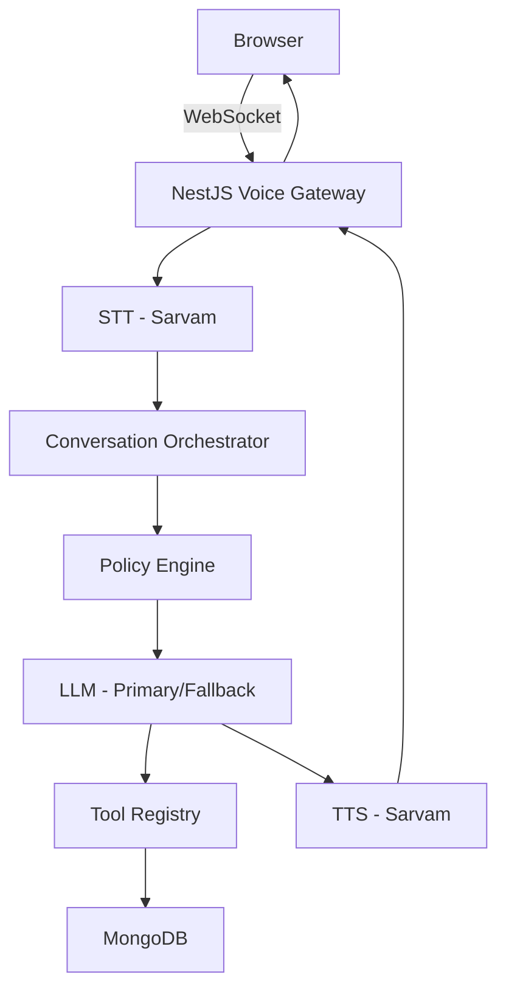

# Aura Skincare AI Voice Customer Support Agent

## Project Overview

This is the backend for **Aria**, an AI voice customer support agent for **Aura Skincare**, a fictional premium organic Indian D2C skincare brand. The agent handles browser-based voice conversations, supporting order tracking, cancellations, returns, policy inquiries, and more — with strict policy enforcement, Hinglish support, and robust fallback handling.

The backend is built with **NestJS**, **MongoDB**, **Redis**, **BullMQ**, and **Sarvam AI** for Indian-language speech capabilities. It exposes REST APIs and a WebSocket gateway for real-time voice streaming.

---

## Architecture



### Voice Pipeline

```
Audio → STT → Intent Detection → Policy/Guardrail Check → LLM → Tool Selection
→ Tool Execution → Result Validation → LLM Response Generation → TTS → Audio Stream → Customer
```

---

## Why NestJS?

NestJS provides a modular, dependency-injected architecture that scales well. Its first-class WebSocket gateway support, validation pipes, Swagger integration, and module system make it ideal for a structured backend with clear separation of concerns. The decorator-based DI model keeps services testable and loosely coupled.

## Why MongoDB?

MongoDB's document model fits naturally with conversation transcripts and call records, which are unstructured and variable in length. Each call session contains a variable number of transcript messages, tool calls, and metadata — document storage handles this without rigid schema migrations. Indexes on `orderId`, `sessionId`, `customerId`, `createdAt`, and `status` ensure fast lookups.

## Why Redis?

Redis serves multiple purposes:
- **Short-lived conversation state**: Session state, active conversation context
- **Distributed locks**: Prevents duplicate summary generation, duplicate call finalization
- **Rate limiting**: Redis-backed counters for API and WebSocket throttling
- **Caching**: Order lookups, policy decisions
- **BullMQ**: Job queue backend for async summary generation and cleanup tasks
- **Idempotency**: Stores recent operation results keyed by `Idempotency-Key`
- **Circuit breaker state**: Shared across instances for coordinated failover

## Why Sarvam?

Sarvam AI specializes in Indian language speech processing. It supports Hindi, Hinglish, and other Indian languages for both STT and TTS — critical for an Indian D2C brand where customers may speak in Hinglish (e.g., "Mera order kab aayega?"). The provider is abstracted behind an interface so it can be replaced without touching business logic.

---

## Retry Strategy

Every external AI request uses:
- **Timeout**: Configurable via `AI_TIMEOUT_MS` (default 15s)
- **Exponential backoff**: Base 500ms, doubling each attempt, capped at 10s
- **Jitter**: Random 0-30% of backoff added to prevent thundering herd
- **Retryable status codes**: 429, 408, 500, 502, 503, 504, ECONNRESET, ETIMEDOUT
- **Non-retryable**: 400, 401, 403 (bad request, auth errors)
- **Max retries**: Configurable via `AI_MAX_RETRIES` (default 2)

## Fallback Strategy

```
Primary Provider → Retry + Backoff → Circuit Breaker Check → Fallback Provider → Deterministic Safe Response
```

- **STT**: Sarvam → fallback provider → safe error message
- **LLM**: Primary LLM → Fallback LLM → deterministic safe response
- **TTS**: Sarvam → fallback provider → text-only response

The application never crashes because an AI provider is unavailable.

## Circuit Breaker

States:
- **CLOSED**: Normal operation, requests flow through
- **OPEN**: After `CIRCUIT_BREAKER_THRESHOLD` consecutive failures, requests blocked for `CIRCUIT_BREAKER_COOLDOWN_MS`
- **HALF_OPEN**: After cooldown, one trial request is allowed. Success → CLOSED, failure → OPEN

State is stored in Redis so it works across multiple backend instances.

## Guardrails

Deterministic business policies exist **outside** the LLM. The `PolicyService` enforces return windows, cancellation eligibility, COD limits, and damaged product rules with code — not prompts. The `GuardrailService` validates every AI response before sending, checking for unauthorized refund promises, invented order details, sensitive info leakage, and out-of-scope responses. If validation fails, a safe fallback response is used.

**Architectural principle**: LLM decides WHAT it needs. Backend decides WHETHER it is allowed. Tools decide HOW data is retrieved. Database is the source of truth. Policy engine is the source of truth for business rules.

---

## API Endpoints

### REST API (prefix: `/api`)

| Method | Path | Description |
|--------|------|-------------|
| POST | `/calls/start` | Start a new voice call |
| POST | `/calls/:sessionId/end` | End call and generate summary |
| GET | `/calls/:sessionId` | Get call details |
| GET | `/calls/:sessionId/transcript` | Get call transcript |
| GET | `/calls/:sessionId/summary` | Get structured call summary |
| GET | `/orders` | Get all orders |
| GET | `/orders/sample` | Get sample orders for testing |
| GET | `/orders/:orderId` | Get order by ID |
| GET | `/health` | Full health check |
| GET | `/health/live` | Liveness probe |
| GET | `/health/ready` | Readiness probe (MongoDB, Redis, AI providers) |
| GET | `/metrics` | Prometheus metrics |
| POST | `/seed` | Seed sample orders |
| GET | `/api/docs` | Swagger documentation |

### WebSocket Events (`/ws/voice`)

| Event | Direction | Description |
|-------|-----------|-------------|
| `session.start` | Client → Server | Start a voice session |
| `audio.input` | Client → Server | Send audio chunk (base64) |
| `audio.end` | Client → Server | End of audio, trigger processing |
| `session.end` | Client → Server | End the session |
| `transcript.partial` | Server → Client | Partial STT result |
| `transcript.final` | Server → Client | Final transcript line |
| `agent.thinking` | Server → Client | Agent is processing |
| `agent.speaking` | Server → Client | Agent is speaking |
| `agent.audio` | Server → Client | Audio chunk (base64) |
| `agent.interrupted` | Server → Client | Barge-in detected |
| `tool.started` | Server → Client | Tool execution started |
| `tool.completed` | Server → Client | Tool execution completed |
| `error` | Server → Client | Error occurred |
| `session.end` | Server → Client | Session ended with summary |

---

## Getting Started

### Prerequisites

- Node.js 20+
- MongoDB 7+
- Redis 7+

### Install & Run

```bash
npm install
cp .env.example .env
# Fill in your API keys
npm run seed
npm run start:dev
```

### Docker

```bash
docker compose up
```

### Seed Orders

```bash
npm run seed
```

Creates ORD-101, ORD-102, ORD-103 (idempotent).

### Tests

```bash
npm test              # unit tests
npm run test:e2e      # integration tests
```

---

## Sample Orders

| Order ID | Customer | Product | Status | Notes |
|----------|----------|---------|--------|-------|
| ORD-101 | Priya Sharma | Vitamin C Serum (30ml) | OUT_FOR_DELIVERY | Expected 6 PM today |
| ORD-102 | Rahul Verma | Hydrating Sunscreen SPF 50 | DELIVERED | 14 days ago |
| ORD-103 | Ananya Patel | Green Tea Face Wash + Toner | PROCESSING | Cancellation eligible |

---

## Environment Variables

See `.env.example` for all configuration options. Key variables:

- `SARVAM_API_KEY` — Sarvam AI API key for STT/TTS
- `LLM_API_KEY` — Primary LLM API key
- `LLM_FALLBACK_API_KEY` — Fallback LLM API key
- `MONGODB_URI` — MongoDB connection string
- `REDIS_URL` — Redis connection string
- `JWT_SECRET` — JWT signing secret
- `AI_TIMEOUT_MS` / `AI_MAX_RETRIES` — Retry configuration

---

## Difficultest Part

The most challenging part was designing the conversation orchestrator to handle the full pipeline — STT, intent detection, LLM tool calling (with the two-pass flow of LLM → tool → LLM), guardrail validation, and TTS — while maintaining clean separation between providers, business logic, and the state machine. Balancing the fallback hierarchy (retry → circuit breaker → fallback provider → safe response) without coupling business logic to any specific AI provider required careful interface design.


## 1,000 Conversations Per Day

At 1,000 calls/day (~42/hour peak), the system scales by:
- **Horizontal scaling**: Stateless backend instances behind a load balancer
- **Redis**: Shared session state, circuit breaker state, and rate limiting across instances
- **Queue workers**: BullMQ summary generation offloaded from the request path
- **MongoDB indexes**: On `orderId`, `sessionId`, `customerId`, `createdAt`, `status`
- **Connection pooling**: Mongoose and Redis connection pools tuned for concurrency
- **Provider rate limits**: Throttler module + circuit breakers prevent provider cost spikes
- **Observability**: Prometheus metrics + structured logging for latency and error tracking
- **Caching**: Redis cache for order lookups and policy decisions
- **Circuit breakers**: Prevent cascading failures when providers degrade
