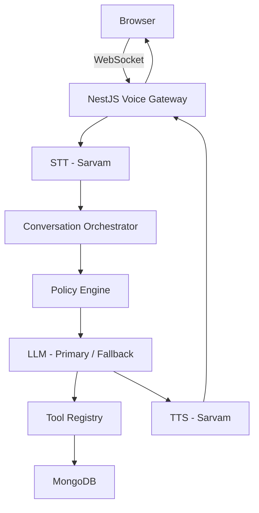
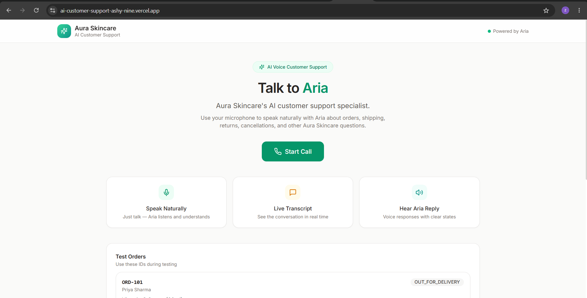
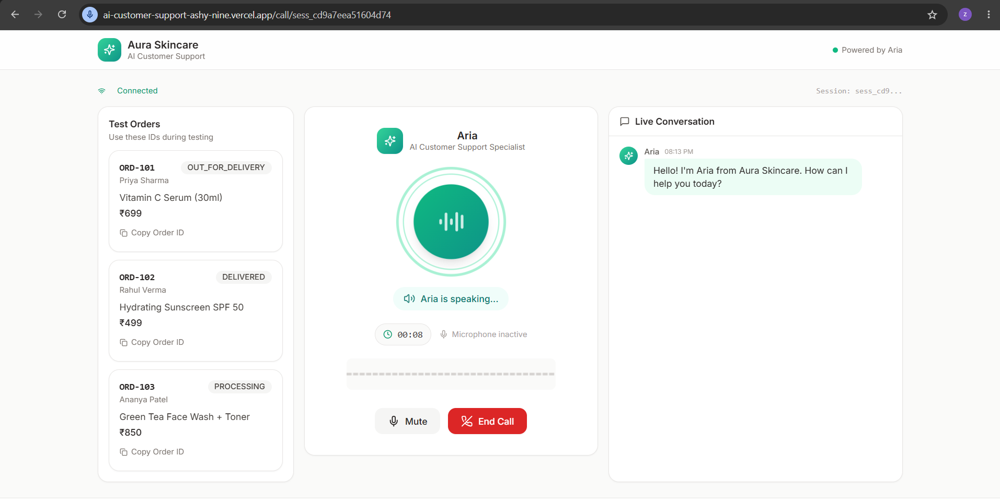
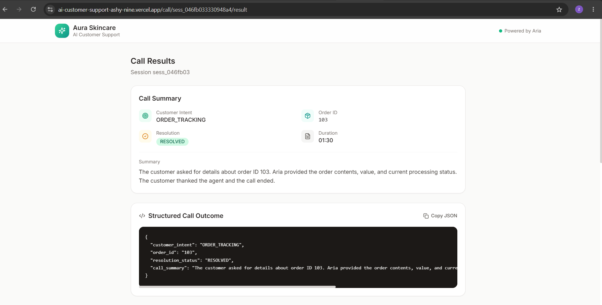
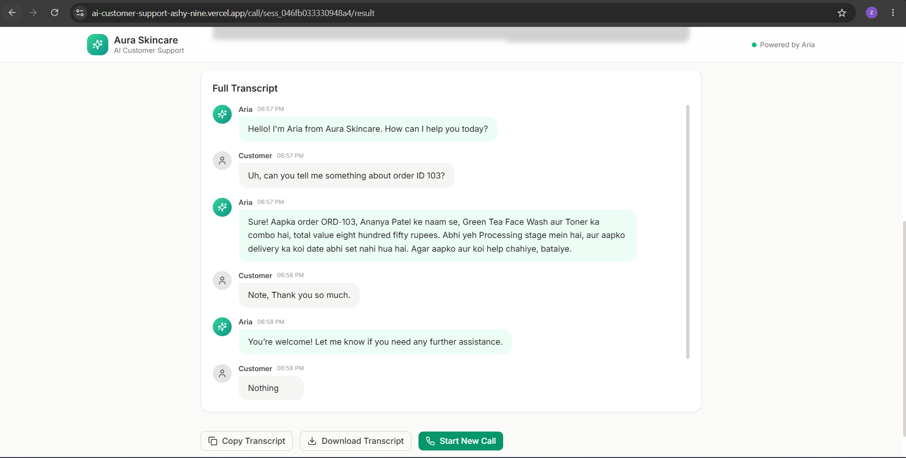

# Aura Skincare - AI Voice Customer Support Agent

## Description

**Aria** is a browser-based AI voice customer support agent for **Aura Skincare**, a fictional premium organic Indian D2C skincare brand. A customer clicks **Start Call**, speaks naturally through the microphone, and hears Aria reply in real time.

Aria can:

- Hold a natural voice conversation in English, Hindi, or Hinglish
- Look up live order details using tool calling (order tracking, cancellation and return eligibility)
- Follow Aura Skincare's shipping, return, cancellation, and COD policies instead of agreeing to everything
- Politely decline out-of-scope requests and admit when she does not have the information
- Generate a full transcript and a structured JSON call outcome after the call ends

The interface also includes a **Test Orders** panel (ORD-101, ORD-102, ORD-103), a live state indicator, and Mute / End Call controls so the agent is easy to test.

---

## Tech Stack

| Layer | Technology |
|-------|------------|
| Frontend | React + Vite |
| Backend | NestJS (TypeScript) |
| Realtime | WebSocket gateway (`/ws/voice`) |
| Speech (STT / TTS) | Sarvam AI (Hindi, Hinglish, English) |
| LLM | Primary LLM with fallback LLM, tool / function calling |
| Database | MongoDB (orders, call sessions, transcripts) |
| Cache / State | Redis (session state, locks, rate limiting, circuit breaker) |
| Queue | BullMQ (async post-call summary generation) |
| Reliability | Retry with backoff, circuit breaker, provider fallback |

---

## Architecture



### Voice Pipeline

```
Audio -> STT -> Intent Detection -> Policy / Guardrail Check -> LLM -> Tool Selection
-> Tool Execution -> Result Validation -> LLM Response Generation -> TTS -> Audio Stream -> Customer
```

**Key principle:** the LLM decides *what* it needs, the backend decides *whether* it is allowed, tools decide *how* data is fetched, and the database and policy engine are the source of truth.

---

## Screenshots

### Home Page


### Live Call


### Call Result - Summary and Structured Outcome


### Call Result - Full Transcript
